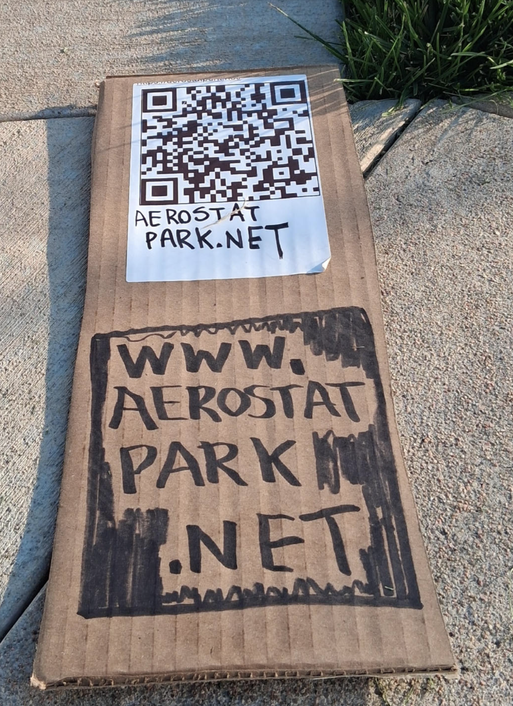
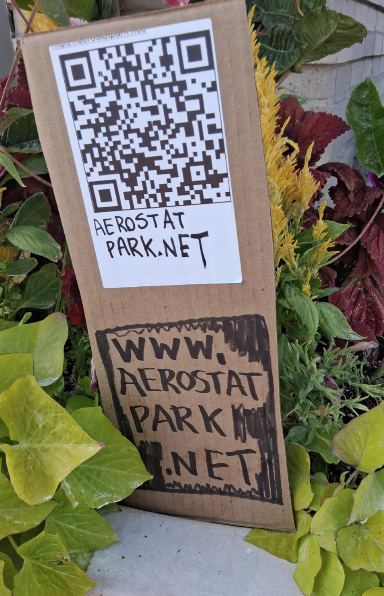

# [aerostatpark.net](https://aerostatpark.net)





self-replicating web swarm

spore.php --> [spore.json](spore.json) --> {self-replicating code set}

```
[
    "README.md",
    "delete-file.php",
    "delete-fork.php",
    "editor.html",
    "fork.html",
    "fork.php",
    "freebox.html",
    "index.html",
    "list-directories.php",
    "list-files.php",
    "load-file.php",
    "market.html",
    "market.txt",
    "meta-spore.php",
    "news.html",
    "news.txt",
    "qrcode.html",
    "readme.html",
    "save-file.php",
    "spore.html",
    "spore.json",
    "spore.php",
    "upload-image.php",
    "wall.txt"
]
```

```
sudo apt update
sudo apt install apache2 -y
sudo apt install php libapache2-mod-php -y
mkdir -p /var/www/[SUBDOMAIN].[DOMAIN].net/public_html
cd /var/www/[SUBDOMAIN].[DOMAIN].net/public_html
sudo curl -o spore.php https://raw.githubusercontent.com/LafeLabs/aerostatpark.net/refs/heads/main/spore.php
php spore.php
cd /etc/apache2/sites-available/
cp [existing domain].conf [SUBDOMAIN].[DOMAIN].net.conf
vi [SUBDOMAIN].[DOMAIN].net.conf
a2ensite [SUBDOMAIN].[DOMAIN].net.conf
systemctl restart apache2
certbot --apache -d [SUBDOMAIN].[DOMAIN].net
chown -R www-data:www-data /var/www/[SUBDOMAIN].[DOMAIN].net/public_html
```

# [http://localhost/aerostatpark.net](http://localhost/aerostatpark.net)

 


